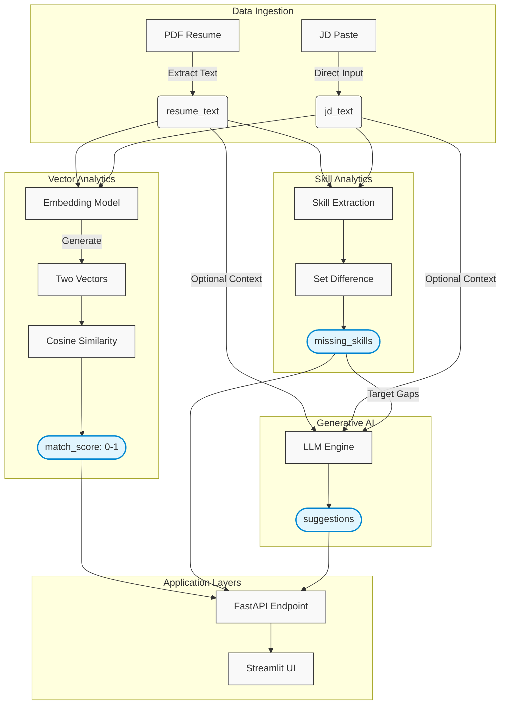

# RESUME_JD-MATCHER
Given a resume and a job description, tell the user how well they match and what's missing.

```mermaid
graph TD
    %% Ingestion Layer
    subgraph Ingestion [Data Ingestion]
        A[PDF Resume] -->|Extract Text| B(resume_text)
        C[JD Paste] -->|Direct Input| D(jd_text)
    end

    %% Semantic Alignment Layer
    subgraph Semantic [Vector Analytics]
        B --> E[Embedding Model]
        D --> E
        E -->|Generate| F[Two Vectors]
        F --> G[Cosine Similarity]
        G --> H([match_score: 0-1])
    end

    %% Keyword Analytics Layer
    subgraph Keywords [Skill Analytics]
        B --> I[Skill Extraction]
        D --> I
        I --> J[Set Difference]
        J --> K([missing_skills])
    end

    %% Inference Layer
    subgraph Inference [Generative AI]
        B -->|Optional Context| L[LLM Engine]
        D -->|Optional Context| L
        K -->|Target Gaps| L
        L --> M([suggestions])
    end

    %% Serving Layer
    subgraph Delivery [Application Layers]
        H --> N[FastAPI Endpoint]
        K --> N
        M --> N
        N --> O[Streamlit UI]
    end

    %% Styling
    classDef default fill:#f9f9f9,stroke:#333,stroke-width:1px;
    classDef output fill:#e1f5fe,stroke:#0288d1,stroke-width:2px;
    class H,K,M output;
```
